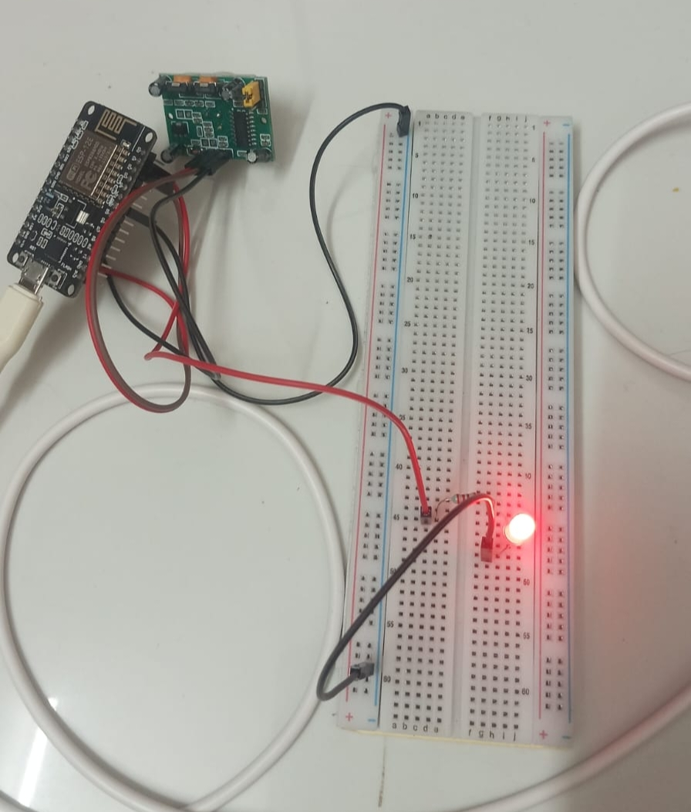
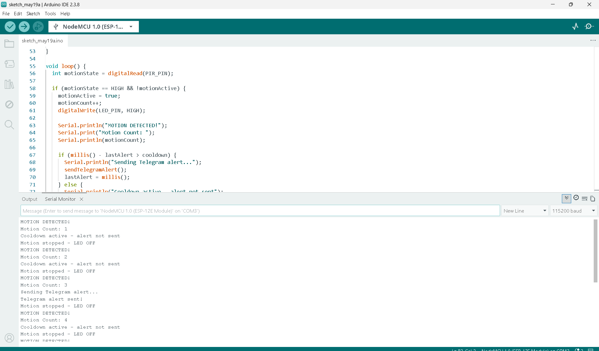
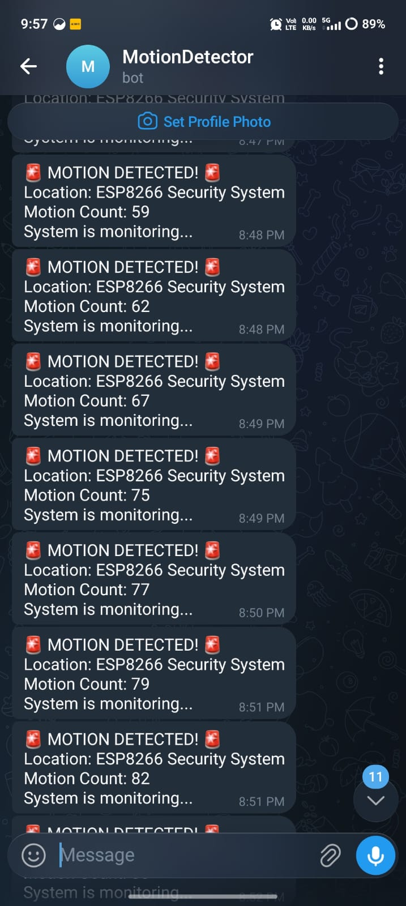

# IoT Motion Detector with Telegram Alert

## Project Overview
This project detects motion using a PIR sensor connected to ESP8266 NodeMCU. When motion is detected, an LED glows as visual indicator and an instant alert message is sent to Telegram Bot. Includes a 30 second cooldown to prevent message flooding.

## Platform
- **Hardware:** ESP8266 NodeMCU + PIR Sensor HC-SR501 + LED
- **Alert:** Telegram Bot
- **IDE:** Arduino IDE 2.x
- **Difficulty:** Medium
- **Type:** Major Project 1 - Hardware Simulation

## Components Used
| Component | Quantity | Description |
|---|---|---|
| ESP8266 NodeMCU | 1 | Wi-Fi microcontroller |
| PIR Sensor HC-SR501 | 1 | Motion detection sensor |
| LED | 1 | Visual motion indicator |
| 220Ω Resistor | 1 | Current limiting resistor |
| Jumper Wires | 5 | Connections |
| USB Cable | 1 | Power and programming |

## Circuit Connections
### PIR Sensor:
| PIR Pin | ESP8266 Pin |
|---|---|
| VCC (+) | Vin (5V) |
| OUT (Signal) | D2 |
| GND (-) | GND |

### LED:
| Component | ESP8266 Pin |
|---|---|
| LED long leg (+) via 220Ω | D1 |
| LED short leg (-) | GND |

## Telegram Bot Setup
1. Open Telegram and search @BotFather
2. Type /newbot and follow instructions
3. Copy the Bot Token
4. Send a message to your bot
5. Get Chat ID from getUpdates URL
6. Replace BOT_TOKEN and CHAT_ID in code

## Libraries Required
- ESP8266WiFi
- WiFiClientSecure
- UniversalTelegramBot by Brian Lough
- ArduinoJson by Benoit Blanchon

## How to Run
1. Install Arduino IDE 2.x
2. Install required libraries
3. Create Telegram Bot via @BotFather
4. Replace WiFi credentials in code
5. Replace BOT_TOKEN and CHAT_ID
6. Upload code to ESP8266
7. Open Serial Monitor at 115200 baud
8. Move in front of PIR sensor to test

## Features
- Real-time motion detection
- LED visual indicator
- Instant Telegram alert with motion count
- 30 second cooldown between alerts
- Motion counter tracking
- PIR stabilization on startup
- Online/Offline Telegram notifications

## How It Works
1. PIR sensor detects infrared radiation from moving objects
2. ESP8266 reads HIGH signal from PIR on D2 pin
3. LED on D1 turns ON as visual indicator
4. Telegram alert sent with motion count
5. 30 second cooldown prevents message flooding
6. LED turns OFF when motion stops

## Output Screenshots
### Circuit Diagram

### Serial Monitor Output

### Motion Detection

### Telegram Alert

## Demo Video
[Watch Demo Video](Major_Project_1.mp4)

## Author
**Poornima M R**
Final Year B.E. Electronics and Communication Engineering
GSSS Institute of Engineering and Technology for Women, Mysuru
VTU Affiliated | 2026 Batch

## Internship
**GlowLogics Solutions Pvt. Ltd.**
IoT Internship 2026
Major Project 1 - Hardware Simulation
